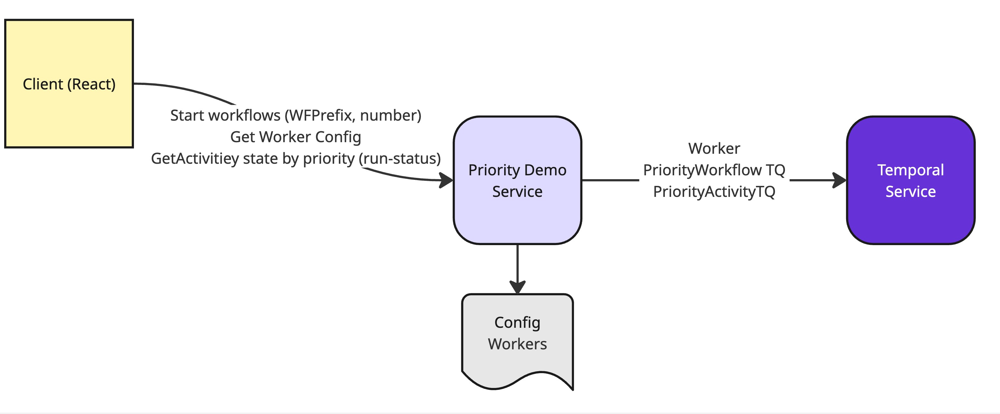

# Demonstration of priority queues in Temporal

This simple demonstration is designed to showcase how priority queues operate in Temporal.  

The application is deployed into two components, a react frontend using Vite that allows the user to specify a prefix to use in a test and how many workflows to run in order to demonstrate the priority queue management.   The workflows are very simple, there is no priority set for the workflow tasks but each workflow consists of 5 activities done in series.  The activities have a priority put on them and so workflows configured for the higher priority will have their activities progressed first.

I have found that with 5 executor threads in the application 100 workflows is enough to showcase the feature clearly.  The Server side is implemented using Java Springboot with the configuration of the workers exposed in the application.yaml file.  The general deployment topology is shown below.


The workflow summary shown below for a single workflow instance.


# Pre-requisites - Setup namespace with search attributes needed.
Using the latest dev server (1.4 or higher, or from docker-compose repo 1.28.1 or higher) set the configuration `matching.useNewMatcher` as mentioned in [pre-release docs](https://docs.google.com/document/d/1FnBZRjlz0eWGWk_bVLmQ3eZOTOJRFO4s4utGdQtWkIQ/edit?tab=t.0). 
Assuming you are using the auto-setup [docker-compose](https://github.com/temporalio/docker-compose) config then add the following to your dynamicconfig
```
matching.useNewMatcher:
  - value: true
    constraints:
       namespace: default
```

If using Temporal cloud then request the enablement of priority queues.  

_Note - if priority queues have not been enabled then the default processing of approximate first in first out to the task queue will apply so all workflows will progress at roughly even speeds._


Ensure that you have added the search attributes **`Priority`** and **`ActivitiesCompleted`** both of type int to the namespace used.  These are needed for the demo as each workflow gets assigned a priority in the input parameters and as the workflow progresses it will update the search attributes with the number of activities completed.  This allows the UI to see how each workflow is progressing and display the results.

```
$ temporal --address localhost:7233 --namespace default operator search-attribute create --name Priority --type int
$ temporal --address localhost:7233 --namespace default operator search-attribute create --name ActivitiesCompleted --type int
```

# Run the application
## Run the UI
The UI is a react application.  To install the dependencies simply run the npm install command
``` 
$ npm install

added 240 packages, and audited 241 packages in 6s

56 packages are looking for funding
  run `npm fund` for details

found 0 vulnerabilities
```
Once installed then the npm run dev will run the development server.  Simply run the startwebui script to start.
``` 
$ ./startwebui.sh

> ui@0.0.0 dev
> vite


  VITE v7.0.6  ready in 193 ms

  ➜  Local:   https://localhost:4000/
  ➜  Network: use --host to expose
  ➜  press h + enter to show help 
```

## Run the Temporal Worker
To start the worker...
If running using a local temporal instance
```
$ ./startlocalworker.sh
```
If running using temporal cloud then we need to get the environment variables set in advance.  The variables you need to get setup are:-
* TEMPORAL_NAMESPACE eg. donald-demo.sdvdw
* TEMPORAL_ADDRESS eg. donald-demo.sdvdw.tmprl.cloud:7233
* TEMPORAL_KEY_PATH eg. /Path/To/Temporal/Client/key/temporal-client.key
* TEMPORAL_CERT_PATH eg. /Path/To/Temporal/Client/Certificate/temporal-client-leaf-cert.pem

With these set you can run `./startcloudworker.sh`. eg.
```
$ TEMPORAL_NAMESPACE=donald-demo.sdvdw TEMPORAL_ADDRESS=donald-demo.sdvdw.tmprl.cloud:7233 TEMPORAL_KEY_PATH=/Users/donald/stuff/source/certificates/temporal-client.key TEMPORAL_CERT_PATH=/Users/donald/stuff/source/certificates/temporal-client-leaf.pem ./startcloudworker.sh

```
However, if you are using the temporal cli and have setup an environment for this you can simply pass in the environment name used and the script will extract the env vars from the settings of the temporal environment.

``` 
$ temporal env get donald-demo
  Property        Value
  address         donald-demo.sdvdw.tmprl.cloud:7233
  namespace       donald-demo.sdvdw
  tls-cert-path   /Users/donald/stuff/source/certificates/temporal-client-leaf.pem
  tls-key-path    /Users/donald/stuff/source/certificates/temporal-client.key

$ ./startcloudworker.sh donald-demo
```

# Using the application
The app is split into two components the web UI that will start a web server up on port 4000 (Configured in vite.config.js) and the worker that also includes an API service which will start up on port 7080 (configured in src/main/resources/application.yaml).
Once both components have successfully started up point the browser at https://localhost:4000.  This will show the interface below.


The system will suffix a number to the "Workflow ID Prefix" so each workflow gets a unique identifier.  In order to build up a queue it is necessary to run a number of workflows, generally 100 are enough to showcase the priority in action but "any" number can be selected.  The system will start the workflows, making use of a delayed start so that all workflows fire at the same time.  (within ratelimiting capabilities of the namespace.)
The results are displayed on the results page with workflows of each "priority" split out and the progress of the activities within each priority are shown with a progress bar.  This means that visually you can see the higher priority workflows completing first.


