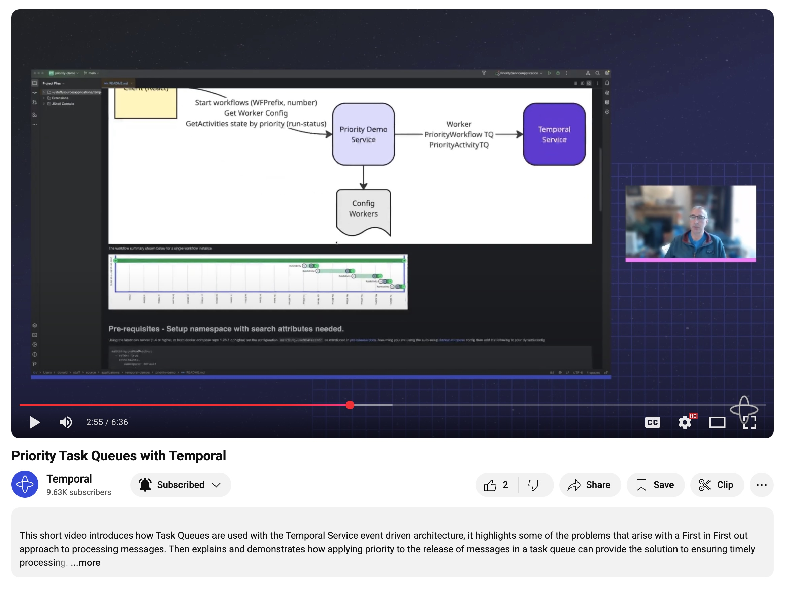
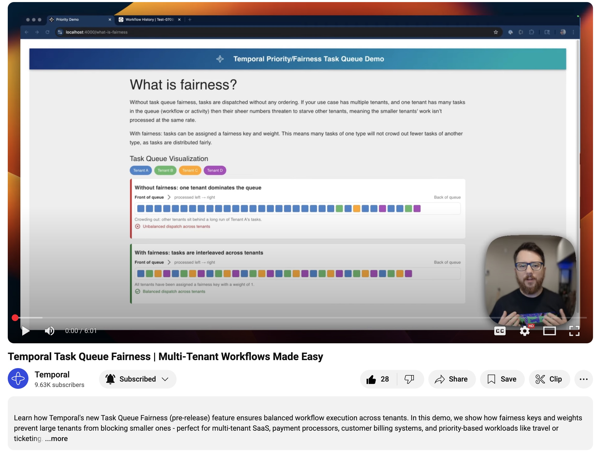
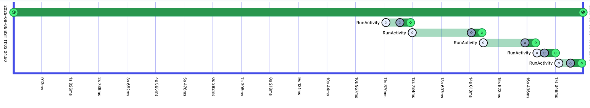
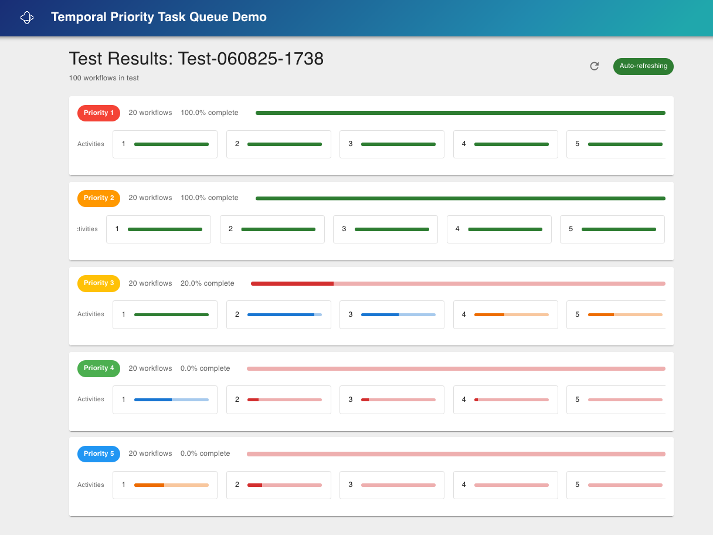

# Temporal Priority/Fairness Task Queue Demo

Have you ever wanted to control the priority of work in a Queue? Have you ever wished for fair processing instead of FIFO?

Good news: Temporal has some new features in pre-release: Task Queue Priority and Task Queue Fairness. These features ensure balanced execution across tenants & users.

This demo shows how to give priority to more important work, and how to prevent large tenants from blocking smaller ones - perfect for multi-tenant SaaS, payment processors, customer billing systems, and workloads like travel or ticketing.

### Watch Donald Forbes demo and explain Priority in this [6 minute video](https://www.youtube.com/watch?v=Nc8d8cNlEwc).
[](https://www.youtube.com/watch?v=Nc8d8cNlEwc)

### Watch Steve Androulakis demo and explain Fairness in this [6 minute video](https://www.youtube.com/watch?v=Cf6_PBoyxbk).
[](https://www.youtube.com/watch?v=Cf6_PBoyxbk)

The app has three components:
- A React frontend (Vite) where you choose a run prefix, number of workflows, and a mode (Priority or Fairness). In Fairness mode you can also configure bands (key + weight).
- A Go backend exposes an API to start workflows and fetch workflow progress grouped by priority or fairness bands.
- A Temporal Worker written in Go

I have found that with 5 executor threads in the application 100 workflows is enough to showcase the feature clearly.

The workflow summary shown below for a single workflow instance.



# Pre-requisites
Using the latest dev server (1.4 or higher, or from docker-compose repo 1.28.1 or higher) enable both the new matcher and fairness in Matching. Set the dynamic config values `matching.useNewMatcher` and `matching.useFairness`.

If you run Temporal via the CLI dev server, start it with both flags, for example:
```
temporal server start-dev \
  --dynamic-config-value matching.useNewMatcher=true \
  --dynamic-config-value matching.useFairness=true
```

Assuming you are using the auto-setup [docker-compose](https://github.com/temporalio/docker-compose) config then add the following to your dynamicconfig
```
matching.useNewMatcher:
  - value: true
    constraints:
       namespace: default
matching.useFairness:
  - value: true
    constraints:
       namespace: default
```

If using Temporal Cloud, request enablement of priority/fairness on your namespace. **Important:** By default this demo uses the `default` task queue for workflows and activities. If you have enabled priority/fairness on a different task queue, then set the `TEMPORAL_TASK_QUEUE` envinroment variable to override the default.

Note: if priority/fairness are not enabled then approximate FIFO dispatch will apply and workflows will progress at roughly even speeds.

Required search attributes
- `Priority` (int)
- `ActivitiesCompleted` (int)
- `FairnessKey` (keyword)
- `FairnessWeight` (int)

You can create them via Temporal CLI:
```
$ temporal --address localhost:7233 --namespace default operator search-attribute create --name Priority --type int
$ temporal --address localhost:7233 --namespace default operator search-attribute create --name ActivitiesCompleted --type int
$ temporal --address localhost:7233 --namespace default operator search-attribute create --name FairnessKey --type keyword
$ temporal --address localhost:7233 --namespace default operator search-attribute create --name FairnessWeight --type int
```

Or use the helper scripts in this repo:
- Local/dev server: `./createlocalsearchattributes.sh`
  - Uses `temporal` CLI; defaults to `TEMPORAL_ADDRESS=localhost:7233`, `TEMPORAL_NAMESPACE=default`.
  - You can override via env vars, for example:
    - `TEMPORAL_ADDRESS=localhost:7234 TEMPORAL_NAMESPACE=my-ns ./createlocalsearchattributes.sh`.
- Temporal Cloud: `./createcloudsearchattributes.sh`
  - Uses `tcld` CLI against your Temporal Cloud namespace.
  - Requires `TEMPORAL_NAMESPACE` to be set, e.g. `export TEMPORAL_NAMESPACE=my-cloud-namespace`.
  - Authentication options:
    - Logged in via `tcld login` (recommended).
    - Or set an API key: the script will automatically use `TEMPORAL_CLOUD_API_KEY` if set, else `TCLD_API_KEY`.
  - Examples:
    - Using current `tcld` login session:
      - `export TEMPORAL_NAMESPACE=my-cloud-namespace && ./createcloudsearchattributes.sh`
    - Using an API key directly:
      - `TEMPORAL_NAMESPACE=my-cloud-namespace TEMPORAL_CLOUD_API_KEY=tsk_abc123 ./createcloudsearchattributes.sh`
      - or `TEMPORAL_NAMESPACE=my-cloud-namespace TCLD_API_KEY=tsk_abc123 ./createcloudsearchattributes.sh`


# Run the application
## Run the UI
The UI lives in `ui/`.
- Install deps: `cd ui && npm ci`
- Start dev server: `cd ui && npm run dev` (served at https://localhost:4000/)
- Or use the helper script from repo root: `ui/startwebui.sh`

## Run the API server
```
go run ./pkg/api
```

## Run the Temporal Worker
If running using a local temporal instance
```
go run ./pkg/worker
```
If running using temporal cloud then we need to get the environment variables set in advance.  The variables you need to get setup are:-
* TEMPORAL_NAMESPACE eg. donald-demo.sdvdw
* TEMPORAL_ADDRESS eg. donald-demo.sdvdw.tmprl.cloud:7233
* TEMPORAL_KEY_PATH eg. /Path/To/Temporal/Client/key/temporal-client.key
* TEMPORAL_CERT_PATH eg. /Path/To/Temporal/Client/Certificate/temporal-client-leaf-cert.pem

With these set you can run `./startcloudworker.sh`. eg.
```
source setcloudenv.sh
go run ./pkg/worker
```

# Using the application
The app is split into three components; the web UI that will start a web server up on port 4000 (Configured in vite.config.js), the Temporal Worker, and the API service which will start up on port 7080.
Once both components have successfully started up point the browser at https://localhost:4000.  This will show the interface below.


The system will suffix a number to the "Workflow ID Prefix" so each workflow gets a unique identifier. In order to build up a queue it is necessary to run a number of workflows; generally 100 are enough to showcase behavior clearly. The system will start the workflows with a small delayed start so they begin at approximately the same time.

Modes
- Priority (default): Workflows assign activity priorities 1..5. Results group by priority and show progress bars per activity. Higher priority workflows progress first when activity executors are constrained.
- Fairness: Each workflow is assigned a fairness key and weight (bands). Defaults are `first-class` (15), `business-class` (5), `economy-class` (1). Results group by fairness key and weight. The UI lets you add/remove bands and edit keys/weights.

Viewing results
- After submit, the UI navigates to `/results/<runPrefix>?mode=priority|fairness`.
- Priority results call `GET /api/run-status` and show groups labeled `Priority N`.
- Fairness results call `GET /api/run-status-fairness` and show groups labeled `<key> (w=<weight>)`.


